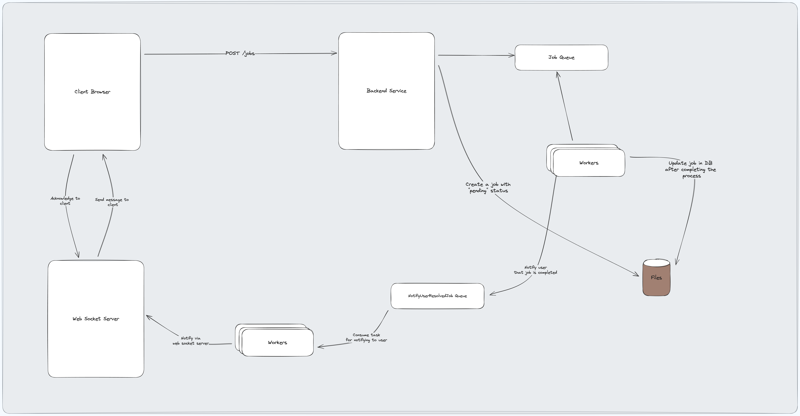

<p align="center">
  <a href="http://nestjs.com/" target="blank"></a>
</p>

[circleci-image]: https://img.shields.io/circleci/build/github/nestjs/nest/master?token=abc123def456
[circleci-url]: https://circleci.com/gh/nestjs/nest

  <p align="center">Job service built on top of nestjs framework for processing of jobs.</p>
  <!--[](https://opencollective.com/nest#backer)
  [](https://opencollective.com/nest#sponsor)-->

## Description

Job service designed for handling of jobs. This service contains three primary endpoints.

- **POST - /jobs** which take the request, acknowledge it, and then, once the job is resolved, communicate the result back to the client via web sockets.
- **GET - /jobs** which returns all the jobs; if the job is resolved, then it will return the result; otherwise, it will return the status of the job.
- **GET - /jobs/{id}** which return the single job; the logic remains same as described in previous point.

<p align="center">
  
  <br/>
</p>

## How is the system working?
- Step 01: The client sends the request to create a job.
- Step 02: The backend server receives the request, creates a job in the db with the status **PENDING**, enqueues the job into the **job** queue for processing & then returns the created job **ID**.
- Step 03: The worker for the **job** queue takes the job and processes it. Once resolved, the job’s status is updated to **COMPLETED**. Then, a task is queued in the **NotifyUserJobResolved** queue to notify the user.
- Step 04: The worker for the **NotifyUserJobResolved** queue takes the task & processes it with web sockets until the user is not notified.

## System Components & Rationale

* **Queue for job processing**
  * Background Processing - We need to process the job asynchronously. 
  * Robustness & Order - We can use built-in retry & prioritisation to make sure the job is always processed in an ordered manner.
  * Scalability - We can quickly scale the number of workers based on traffic.
* **Web sockets**
  * I am using WebSocket with **socket** protocol primarily with fallback on **long-polling** to handle the intermittent unstable internet issue.
  * Why didn’t you go only with a **long polling strategy**? Due to the system’s **high throughput**, I decided not to rely on long polling as it’s **resource-intensive**. However, due to **unstable internet issues**, I can’t rely only on **web sockets**; therefore, I chose to use a combination of both to balance out the needs.
  * I have implemented a retry strategy to make sure the delivery mechanism is at least once. For simplicity, retrying with a backoff strategy with a maximum of 10 attempts, but we can tweak it according to our needs. With sessions & database we can make web socket communication mechanism more robust.
* **Queue for notification processing**
  * It offers all the benefits we mentioned above. Using our current task queue setup for notification processing works well, but considering Kafka as an alternative could provide enhanced scalability & real-time event processing which might be more beneficial to us as we scale.

## What I didn't focus on
- I didn’t write tests, as my primary focus was to implement this POC.
- I didn’t focus primarily on design principles so that you might see redundant code or classes having multiple responsiblities. I hope this is understandable.

## Time spent on each section
- Designing the system - 4-5 hours.
- Implement the APIs - 3-4 hours.
- Implementing the queue (BullMQ) & Consumer - 3-4
- Implementing the websockets - 5-6 hours.
- Implementing the frontend - 5-7 hours.

## Installation
After cloning the repository, run the following command on your machine.
```bash
# node & npm version on my machine
# node version: v18.18.0
# npm version: 10.8.2

$ npm install
```

## Running the app

```bash
# Docker build
$ docker-compose build

# Docker up - If port 3000 is already in use, then update the port in main.ts & run this command again.
$docker-compose up
```


